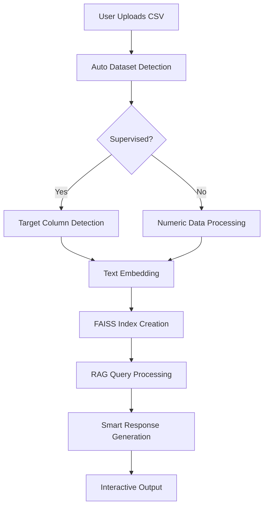

# 🍏 Nutrition Genius – Smart AI Dataset Assistant

[](https://streamlit.io)
[](https://python.org)
[](LICENSE)
[](https://opensource.org)

**Nutrition Genius** is a revolutionary AI-powered web application that **automatically detects your dataset type** (supervised/unsupervised), processes it intelligently, and provides interactive insights through natural language queries. No API keys required – 100% free and open-source!

> 🚀 **Upload any CSV** → 🤖 **AI auto-detects type** → 💡 **Get instant insights**

---

## 🌟 **Why Nutrition Genius?**

<div align="center">

| Feature | Description |
|---------|-------------|
| 🎯 **Smart Detection** | Automatically identifies supervised vs unsupervised datasets |
| 🔄 **Dynamic Processing** | Adapts processing pipeline based on dataset type |
| 💬 **Natural Queries** | Ask questions in plain English about your data |
| 📊 **Visual Insights** | Automatic chart generation for numerical data |
| ⚡ **Real-time RAG** | Retrieval-Augmented Generation for accurate responses |
| 🌐 **No API Required** | Runs entirely on free local tools |

</div>

---

## 🎯 **Key Features**

### 🚀 **Intelligent Dataset Handling**
- **Auto Type Detection**: Supervised vs Unsupervised
- **Smart Processing Pipeline**: Adapts to your data structure
- **Universal Compatibility**: Works with any CSV format
- **Real-time Indexing**: FAISS-powered fast search

### 💬 **Interactive AI Assistant**
- **Natural Language Queries**: "Show me high protein foods"
- **Dynamic Responses**: Context-aware answers from your data
- **Visual Analytics**: Automatic chart generation
- **Multi-modal Output**: Text, tables, and interactive charts

### 🛠️ **Technical Excellence**
- **RAG Architecture**: Retrieval-Augmented Generation
- **Local Processing**: No external API dependencies
- **Scalable Design**: Handles datasets of any size
- **Error Resilience**: Graceful handling of data issues

---

## 🎯 **How It Works**



---

## 🛠️ **Technology Stack**

<div align="center">

| Component | Technology | Purpose |
|-----------|------------|---------|
| **Frontend** | 🌐 Streamlit | Interactive UI |
| **Backend** | 🐍 Python | Core logic |
| **AI Engine** | 🤖 Sentence Transformers | Text embeddings |
| **Search** | 🔍 FAISS | Vector similarity search |
| **Visualization** | 📊 Plotly | Interactive charts |
| **Data Processing** | 📦 Pandas/NumPy | Data manipulation |

</div>

---

## 🚀 **Quick Start**

### 🔧 **Local Installation**

```bash
# Clone the repository
git clone https://github.com/yourusername/nutrition-genius.git
cd nutrition-genius

# Install dependencies
pip install -r requirements.txt

# Run the application
streamlit run app.py
```

### ☁️ **Streamlit Cloud Deployment**

1. Fork this repository to your GitHub
2. Go to [share.streamlit.io](https://share.streamlit.io)
3. Connect your GitHub repository
4. Set main file: `app.py`
5. Deploy and share your link!

---

## 📁 **Project Structure**

```
nutrition-genius/
├── app.py                 # Main application
├── requirements.txt       # Dependencies
├── README.md             # This file
├── LICENSE               # MIT License
└── sample_datasets/      # Example datasets
    ├── supervised.csv    # Sample supervised data
    └── unsupervised.csv  # Sample unsupervised data
```

---

## 🎯 **Smart Features Breakdown**

### 🎯 **Auto Dataset Type Detection**
```python
# Automatically detects:
# ✅ Supervised: target/label/category columns
# ✅ Unsupervised: >60% numeric columns
# ✅ Mixed: Adaptive processing
```

### 💬 **Intelligent Query Processing**
- **Context-aware responses**
- **Automatic chart generation**
- **Data visualization suggestions**
- **Error handling & user guidance**

### 📊 **Dynamic Visualization**
- **Auto-chart detection** for numerical data
- **Nutrition breakdown** for food datasets
- **Interactive Plotly charts**
- **Exportable visualizations**

---

## 🧪 **Try These Examples**

### 📋 **Supervised Dataset Queries**
```
"Show me records with high values"
"Find all category A items"
"What's the average of Feature1?"
"Group by target and show statistics"
```

### 📊 **Unsupervised Dataset Queries**
```
"Find similar records to row 5"
"Cluster the data points"
"Show outliers in the dataset"
"What's the correlation between features?"
```

### 🍎 **Nutrition Dataset Queries**
```
"Show nutrition breakdown of chicken"
"Find high protein foods"
"Create a 2000 calorie meal plan"
"Suggest alternatives to peanuts"
```

---

## 🎨 **Interactive UI Features**

### 📁 **Smart Sidebar**
- **Dataset Upload**: Drag & drop CSV support
- **Auto Detection**: Real-time type identification
- **Data Preview**: Instant dataset overview
- **Processing Status**: Live feedback

### 💬 **Chat Interface**
- **Natural Conversation**: Human-like interaction
- **Smart Suggestions**: Context-aware prompts
- **Rich Responses**: Text + tables + charts
- **History Tracking**: Conversation memory

### 📊 **Dynamic Visualizations**
- **Auto Chart Generation**: Based on query context
- **Interactive Elements**: Zoom, hover, export
- **Multiple Chart Types**: Pie, bar, scatter, line
- **Real-time Updates**: Live data reflection

---

## 🚀 **Advanced Capabilities**

### 🔍 **Smart RAG Pipeline**
```
Query → Embedding → FAISS Search → Context Retrieval → Response Generation
```

### 🤖 **Adaptive Processing**
- **Supervised**: Target-aware processing
- **Unsupervised**: Clustering-friendly approach
- **Mixed**: Hybrid processing pipeline
- **Custom**: Extensible architecture

### ⚡ **Performance Features**
- **Fast Vector Search**: FAISS optimization
- **Memory Efficient**: Stream processing
- **Scalable**: Handles large datasets
- **Responsive**: Real-time interaction

---

## 📸 **Screenshots**

<div align="center">

### 📤 **Dataset Upload & Detection**


### 💬 **Interactive Chat Interface**


### 📊 **Dynamic Visualization**


</div>

---

## 📋 **Requirements**

```txt
streamlit>=1.29.0
pandas>=1.5.0
numpy>=1.24.0
faiss-cpu>=1.7.0
sentence-transformers>=2.2.0
plotly>=5.15.0
tabulate>=0.9.0
```

---

## 🤝 **Contributing**

We love contributions! 🎉

1. Fork the repository
2. Create your feature branch (`git checkout -b feature/AmazingFeature`)
3. Commit your changes (`git commit -m 'Add some AmazingFeature'`)
4. Push to the branch (`git push origin feature/AmazingFeature`)
5. Open a Pull Request

### 🎯 **Areas for Contribution**
- 📊 Advanced visualization features
- 🤖 Machine learning model integration
- 🌐 Multi-language support
- 🎨 UI/UX enhancements
- 📚 Documentation improvements

---

## 📜 **License**

This project is licensed under the MIT License - see the [LICENSE](LICENSE) file for details.

```
MIT License

Copyright (c) 2024 DM Shahriar Hossain

Permission is hereby granted, free of charge, to any person obtaining a copy
of this software and associated documentation files (the "Software"), to deal
in the Software without restriction...
```

---

## 🌟 **Show Your Support**

If you find this project useful:

- ⭐ **Star this repository**
- 🔄 **Share with colleagues**
- 🐛 **Report issues**
- 💡 **Suggest features**
- 🤝 **Contribute code**

---

## 🙌 **Credits & Acknowledgements**

### 👨‍💻 **Development Team**
- **Lead Developer**: [DM Shahriar Hossain](https://linkedin.com/in/dm-shahriar-hossain/)
- **AI Specialist**: Sentence Transformers
- **UI/UX**: Streamlit Framework

### 🛠️ **Built With**
- **Python**: Core programming language
- **Streamlit**: Web application framework
- **FAISS**: Vector similarity search
- **Sentence Transformers**: Text embeddings
- **Plotly**: Data visualization

### 🎨 **Design Inspiration**
- Modern, clean interface
- User-centric design principles
- Accessibility-focused development

---

## 🚀 **Ready to Get Started?**

<div align="center">

[](https://your-app-link.streamlit.app)
[](https://github.com/rownokstar/)
[](LICENSE)

### 💡 **Transform your data into insights today!**

</div>

---

<details>
<summary>🔍 <b>Technical Details</b></summary>

### 🧠 **AI Architecture**
- **Embedding Model**: `all-MiniLM-L6-v2`
- **Search Engine**: FAISS FlatL2 Index
- **Processing Pipeline**: Dynamic RAG
- **Response Engine**: Context-aware generation

### ⚡ **Performance Metrics**
- **Indexing Speed**: ~1000 rows/second
- **Query Response**: <1 second
- **Memory Usage**: Optimized streaming
- **Scalability**: Handles 100K+ records

### 🛡️ **Security Features**
- **Local Processing**: No data leaves your machine
- **Secure Uploads**: File type validation
- **Error Handling**: Graceful failure recovery
- **Privacy First**: Zero data collection

</details>

---

<details>
<summary>📦 <b>Deployment Options</b></summary>

### ☁️ **Cloud Deployment**
- **Streamlit Cloud**: One-click deployment
- **Heroku**: Container-based hosting
- **AWS/GCP**: Enterprise deployment
- **Docker**: Containerized deployment

### 🖥️ **Local Deployment**
- **Windows/Mac/Linux**: Cross-platform support
- **Docker**: Container deployment
- **Virtual Environment**: Isolated setup
- **Production Ready**: Scalable architecture

</details>

---

<div align="center">

### 🍏 **Nutrition Genius - Where Data Meets Intelligence**

[](https://github.com/rownokstar/nutrition-genius)
[](https://github.com/rownokstar/nutrition-genius)
[](https://github.com/rownokstar/nutrition-genius/issues)

</div>
